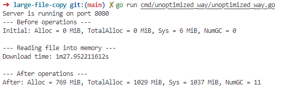
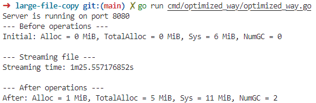

# Large File Copy Demo

This project demonstrates the performance differences between streaming and buffering large files to memory, with a focus on memory usage optimization and execution time comparison.

## 🎯 Purpose

This demo benchmarks memory usage and execution time between two approaches for handling large files:

1. 🐌 **Unoptimized Approach**: Downloads the entire file into memory buffer before serving
2. ⚡ **Optimized Approach**: Streams the file directly from source to client

The key benefits of using optimized streaming, especially in serverless functions with limited memory:

- 🧠 **Memory Efficiency**: Dramatically reduces memory footprint
- 📈 **Scalability**: Can handle files larger than available memory
- ⚙️ **Resource Management**: Better utilization of system resources
- 💰 **Cost Optimization**: Lower memory usage translates to reduced costs in cloud environments

## 🔧 Method

The program implements two different approaches for serving large files via HTTP:

### General Workflow

1. 🚀 **Server Setup**: Both implementations start an HTTP server on port 8080
2. 📥 **File Download**: Downloads a 500MB test file from `https://link.testfile.org/500MB`
3. 📊 **Memory Monitoring**: Tracks memory usage before and after operations
4. 🌐 **File Serving**: Serves the file to HTTP clients
5. ⏱️ **Performance Measurement**: Records execution time and memory consumption

### Key Differences

#### Unoptimized Version (Buffer to Memory)

```go
// Downloads entire file into memory buffer
var buf bytes.Buffer
_, err = io.Copy(&buf, body)
if err != nil {
    log.Fatal(err)
}
w.Write(buf.Bytes()) // Serves from memory
```

#### Optimized Version (Streaming)

```go
// Streams directly from source to client
if _, err := io.Copy(w, body); err != nil {
    log.Fatal(err)
}
```

The critical difference is that the unoptimized version stores the entire file in memory using `bytes.Buffer`, while the optimized version uses `io.Copy` to stream data directly from the HTTP response body to the client without buffering.

## 📊 Results

### Memory Usage Comparison


_Unoptimized approach: TotalAlloc = 1029 MiB_


_Optimized approach: TotalAlloc = 5 MiB_

### Performance Analysis

- 📉 **Memory Reduction**: 99.5% reduction in memory usage (1029 MiB → 5 MiB)
- ⚡ **Time Difference**: Only ~2 seconds faster with optimized approach
- 🌍 **Network Impact**: Performance improvement could be 2x faster when server and client are on different deployments due to bandwidth considerations

The unoptimized version requires the server to download the entire file first before streaming, while the optimized version streams simultaneously, reducing latency especially in distributed environments.

## ✅ Conclusion

**Use optimized streaming methods whenever possible**, except when file preprocessing is required. The benefits include:

- 💾 **Massive memory savings** (99.5% reduction)
- 📈 **Better scalability** for large files
- ⚙️ **Improved resource utilization**
- 💰 **Reduced costs** in cloud/serverless environments

Only choose the unoptimized approach when you need to:

- 🔍 Read the entire file for preprocessing
- 📋 Perform file analysis or validation
- 🔄 Apply transformations that require full file access

For most use cases, especially in production environments with memory constraints, the streaming approach provides superior performance and resource efficiency.
